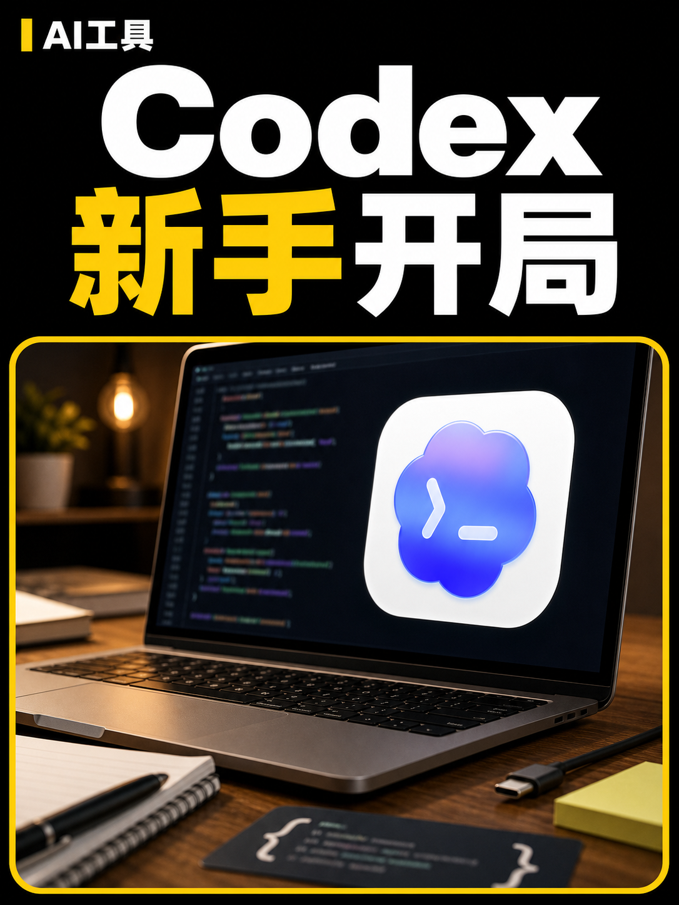
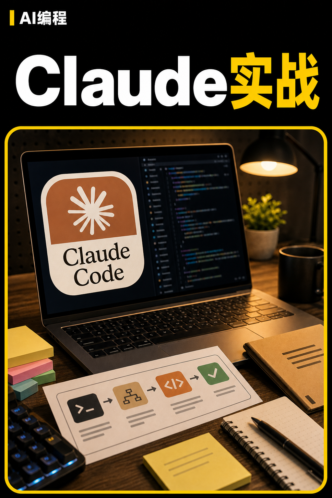
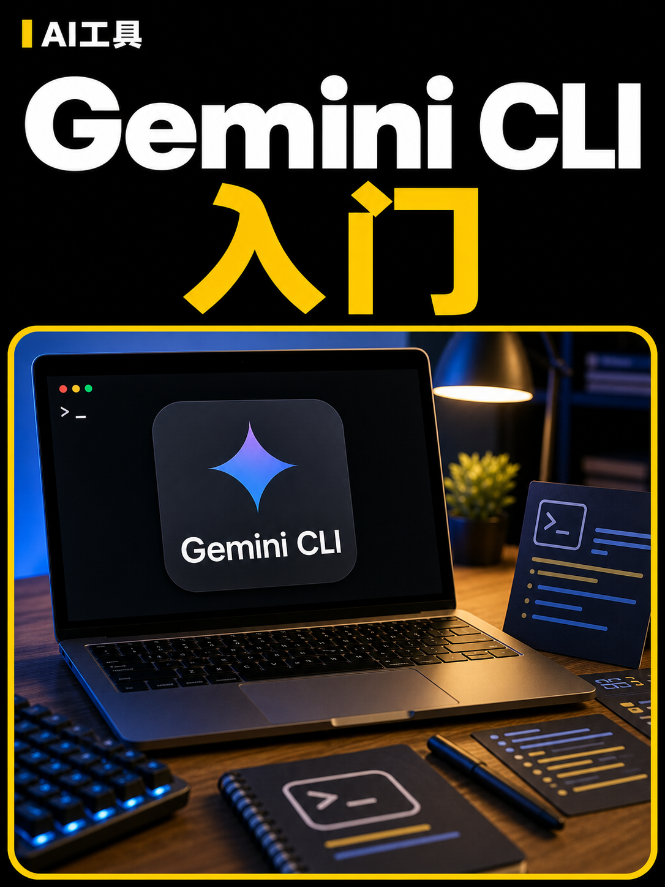

# wangyong-skills

一组面向中文创作者、个人效率和内容生产场景的 AI Agent skills。

每个 skill 都是一个独立目录，入口文件是 `SKILL.md`。只要你的 Agent 支持读取 `SKILL.md` 形式的技能目录，就可以安装和使用本项目里的单个 skill，或一次性安装全部 skill。

## Skills

| Skill | 适合做什么 | 是否需要 API |
| --- | --- | --- |
| `wechat-article-collector` | 采集微信公众号历史文章，导出 Markdown、账号概览和 CSV 数据 | 需要大加啦/极致了 API key |
| `wechat-comic-longform` | 把主题、草稿或文章结构做成微信公众号漫画长图 | 拼接只需本地 Python；批量生图需要豆包/Seedream API |
| `macos-app-icon` | 生成、优化、预览和打包 macOS 应用图标 `.icns` | 通常不需要 API，可能需要图片生成能力 |
| `life-interview-planner` | 通过结构化访谈挖掘人生方向、优势假设、价值观和低风险实验 | 不需要 API |
| `ai-creator-cover` | 通过访谈、方案卡和中文提示词设计 AI 自媒体视频封面 | 需要 Agent 自带图片生成能力 |

## 效果预览

精选示例图会直接展示在 README 中，较长图片保留原图链接查看。

| Skill | 示例 |
| --- | --- |
| `wechat-article-collector` | [查看采集效果](./docs/examples/wechat-article-collector.png) |
| `wechat-comic-longform` | [风格一](./docs/examples/wechat-comic-style-1.png) / [风格二](./docs/examples/wechat-comic-style-2.png) / [风格三](./docs/examples/wechat-comic-style-3.png) |
| `ai-creator-cover` | [查看全部封面示例](./ai-creator-cover/assets/examples/showcase/) |

### AI 自媒体封面示例

这些示例统一保存在 `ai-creator-cover/assets/examples/showcase/`。真人出镜是主要封面形态，无人像工具封面作为备选方案。

#### 真人封面（主要）

| Codex 01 | Codex 02 | Codex 03 | Codex 04 |
| --- | --- | --- | --- |
|  |  |  |  |

| Codex 05 | AI 视频 | 新模型 | 亲和力 |
| --- | --- | --- | --- |
|  |  |  |  |

#### 无人像封面（备选）

| Codex | ChatGPT | Claude Code | Gemini CLI |
| --- | --- | --- | --- |
|  |  |  |  |

| Cursor |
| --- |
|  |

## 项目结构

```text
wangyong-skills/
  README.md
  LICENSE
  .env.example
  docs/examples/
  wechat-article-collector/
    SKILL.md
    scripts/
  wechat-comic-longform/
    SKILL.md
    requirements.txt
    docs/
    scripts/
    templates/
  macos-app-icon/
    SKILL.md
  life-interview-planner/
    SKILL.md
    references/
  ai-creator-cover/
    SKILL.md
    requirements.txt
    assets/examples/showcase/
    profile.md
    references/
```

约定：

- 每个顶层 skill 目录都应该有 `SKILL.md`。
- 目录名使用 kebab-case，并尽量和 `SKILL.md` frontmatter 里的 `name` 保持一致。
- 脚本放在 `scripts/`，参考资料放在 `docs/` 或 `references/`，模板放在 `templates/`。
- 输出文件、API key、Cookie、个人照片和本地研究素材不要提交到仓库。

## 小白快速开始

### 方式一：让你的 Agent 自动安装

把下面这段话复制给支持 skills 的 AI Agent：

```text
请帮我安装这个 GitHub 仓库里的 AI Agent skills：
https://github.com/wangyong5609/wangyong-skills

请先确认你当前环境支持的 skills 安装目录和格式，然后下载这个仓库，把里面的 skill 目录安装到正确位置。安装完成后，请告诉我安装了哪些 skill，以及是否需要重启 Agent 或新开会话。
```

只安装一个 skill 时，把 `<skill-name>` 换成上表里的名字：

```text
请帮我只安装这个仓库里的 <skill-name>：
https://github.com/wangyong5609/wangyong-skills

请先确认你当前环境支持的 skills 安装目录和格式，然后只安装这个 skill。
```

### 方式二：手动安装到 Codex

如果你使用的是 Codex 兼容的本地 skills 目录，可以这样安装全部 skill：

```bash
git clone https://github.com/wangyong5609/wangyong-skills.git
cd wangyong-skills
mkdir -p ~/.codex/skills
cp -R wechat-article-collector wechat-comic-longform macos-app-icon life-interview-planner ai-creator-cover ~/.codex/skills/
```

只安装一个 skill，例如 `ai-creator-cover`：

```bash
mkdir -p ~/.codex/skills
cp -R ai-creator-cover ~/.codex/skills/
```

安装后，重启 Agent 或新开一个会话，让它重新读取 skills。

## 基础依赖

如果你只使用纯文本访谈类 skill，不需要安装 Python 依赖。

这个仓库不提供根目录统一依赖文件。每个有脚本依赖的 skill 自己维护 `requirements.txt`，按需安装即可：

```bash
python3 -m pip install -r wechat-comic-longform/requirements.txt
python3 -m pip install -r ai-creator-cover/requirements.txt
```

`wechat-comic-longform/requirements.txt` 用于漫画长图拼接脚本。`ai-creator-cover/requirements.txt` 只用于研究辅助脚本 `download_covers.py`，日常封面设计不需要安装它。

`macos-app-icon` 如果需要本地处理图标，建议安装 ImageMagick：

```bash
brew install imagemagick
```

## API key 配置

复制 `.env.example` 为 `.env`，再填入自己的 key：

```bash
cp .env.example .env
```

常用变量：

| 变量 | 用途 |
| --- | --- |
| `DAJIALA_API_KEY` | 微信公众号文章采集 |
| `DAJIALA_VERIFY_CODE` | 大加啦/极致了附加码，没有可留空 |
| `DAJIALA_COOKIE` | 可选 Cookie |
| `DOUBAO_API_KEY` | 豆包/Seedream 批量生图 |
| `ARK_API_KEY` | 火山方舟 API key 兼容变量 |

不要把 `.env`、Cookie、个人图片或生成结果提交到仓库。

## 小白使用教程

### 1. 采集微信公众号文章

适合想把某个公众号历史文章保存成 Markdown 和 CSV 的场景。

准备：

1. 注册或登录大加啦/极致了接口页：`https://www.dajiala.com/main/interface?actnav=0`
2. 拿到 API key。
3. 在 `.env` 中填写 `DAJIALA_API_KEY`。

对 Agent 说：

```text
Use $wechat-article-collector 采集「公众号名称」的历史文章，保存到 output/wechat-articles。
```

也可以直接运行脚本：

```bash
python3 wechat-article-collector/scripts/collect_wechat_articles.py \
  --account "公众号名称" \
  --output-dir output/wechat-articles
```

输出内容包括每篇文章的 Markdown、`账号概览.md` 和 `文章数据.csv`。

### 2. 生成微信公众号漫画长图

适合把一个主题做成可发布的公众号漫画长图。

对 Agent 说：

```text
Use $wechat-comic-longform 把「为什么下午三点最容易困」做成风格一的公众号漫画长图。
```

如果你有豆包/Seedream API key，可以让 Agent 使用批量生图脚本。如果没有，也可以让 Agent 使用它自己可用的图片生成能力先生成 panels，再用本仓库脚本拼接长图。

拼接脚本示例：

```bash
python3 wechat-comic-longform/scripts/build_long_comic.py \
  --spec output/comics/文章标题/article.json \
  --out output/comics/文章标题/文章标题-公众号漫画长图.png
```

### 3. 生成 macOS 应用图标

适合把一张图或一个图标创意做成 macOS `.icns`。

对 Agent 说：

```text
Use $macos-app-icon 根据这张图片生成 macOS .icns 图标，并给我灰底预览。
```

Agent 会优先使用系统工具和 ImageMagick 处理图标，并输出 `.icns` 和预览图。

### 4. 做人生方向访谈

适合你不知道该问自己什么问题，但想系统梳理方向、优势和验证实验。

对 Agent 说：

```text
Use $life-interview-planner 和我做一次 60 分钟的人生方向访谈。
```

它会一轮一轮提问，记录具体经历、能量信号、能力模式、价值观、约束和可测试方向。

### 5. 设计 AI 自媒体视频封面

适合给 AI 工具、教程、观点类视频做封面。

第一次用前，打开 `ai-creator-cover/profile.md`，把账号方向、品牌色、分类标签改成自己的。如果你要真人出镜，把 2-4 张参考照片放到本地安装目录里的：

```text
ai-creator-cover/assets/faces/<你的名字>/
```

这些照片已被 `.gitignore` 忽略，不应该提交到公开仓库。

对 Agent 说：

```text
Use $ai-creator-cover 帮我设计一张 AI 自媒体视频封面。这期视频讲 Claude 的新功能。
```

它会先访谈，再给封面方案卡。你确认后，它会编译中文生图提示词；只有你明确说“生成图片”时，才会调用图片生成能力。

## 开发和维护

常用检查命令：

```bash
git status --short
python3 -m py_compile wechat-article-collector/scripts/collect_wechat_articles.py
python3 -m py_compile wechat-comic-longform/scripts/build_long_comic.py
python3 -m py_compile wechat-comic-longform/scripts/generate_panels_seedream.py
python3 -m py_compile ai-creator-cover/scripts/download_covers.py
```

新增 skill 时建议包含：

```text
skill-name/
  SKILL.md
  agents/ or config/
  scripts/
  docs/ or references/
  templates/
```

`SKILL.md` 需要有 frontmatter：

```yaml
---
name: example-skill
description: Short trigger-focused description.
---
```

## 开源许可

本项目使用 MIT License，见 [LICENSE](./LICENSE)。
