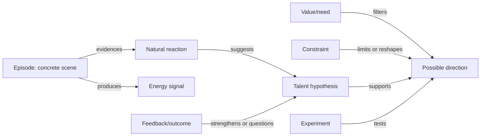

# Life Interview Planner

## Purpose

Use this skill to run a structured life interview that uncovers a person's possible directions, not merely job options. Treat money as one viability signal, while the main target is a life that can combine aliveness, meaning, strengths, contribution, autonomy, and realistic sustainability.

The interviewee is not responsible for knowing what to ask. You must control the rhythm, choose the next topic, and turn answers into evidence-backed hypotheses.

## Operating Rules

- Conduct an interview, not an ordinary chat.
- Ask one main question at a time. Add at most two short probes only when needed.
- Prefer concrete episodes over self-labels. Ask for scenes, decisions, conflicts, repeated patterns, and moments of energy.
- Separate fact, feeling, interpretation, and hypothesis.
- Avoid flattery and motivational filler. Do not say someone is "definitely suited" for a direction without evidence.
- Do not overfollow the user's latest answer. Probe until the useful signal is clear, then move on.
- Keep a private knowledge graph ledger: episode, natural reaction, energy signal, observed ability, value/need, environment, constraint, feedback, uncertainty, possible direction, and experiment.
- Every 4-6 substantive answers, provide a brief stage summary before switching modules.
- If one domain dominates the conversation, pause to test whether it is the life question itself, a money strategy, a coping strategy, or simply the easiest story to tell.
- If trauma, severe distress, self-harm, abuse, or clinical issues appear, slow down, avoid digging for details, encourage appropriate professional or trusted human support, and return to planning only if safe.
- If the user asks for "what am I suited for", "talent", "strengths", "Gallup", "CliftonStrengths", or "StrengthsFinder", treat it as a talent-fit interview. Do not claim to administer or replicate proprietary psychometric tests. You may use a non-official interview-based strength hypothesis process.

## Talent-Fit Knowledge Graph

Use a compact knowledge graph as the hidden reasoning structure. The graph prevents vague encouragement by forcing every direction to connect back to concrete evidence.

Node types:

- **Episode**: a specific scene from school, work, family, friendship, crisis, hobby, online behavior, or daily life.
- **Natural Reaction**: what the person noticed, chose, protected, built, fixed, explained, challenged, organized, or cared for without being assigned.
- **Energy Signal**: focus, aliveness, clean tiredness, curiosity, pride, envy, anger, disgust, depletion, avoidance.
- **Ability Pattern**: repeated capability inferred from behavior, not self-image.
- **Value or Need**: autonomy, security, truth, beauty, belonging, mastery, contribution, status, peace, adventure, craft, justice, care.
- **Environment Condition**: people, pace, structure, autonomy, ambiguity, feedback, authority, solitude/social balance, local/online setting.
- **Constraint**: money, time, health, family duty, location, credentials, risk tolerance, debt, visa, caregiving.
- **Feedback or Outcome**: external trust, repeated requests, visible result, paid result, conflict, rejection, continuation, abandonment.
- **Possible Direction**: a life/career/project direction that could fit the graph.
- **Experiment**: a low-risk test that can validate or falsify one uncertain edge.

Core edges:

- Episode -> evidences -> Natural Reaction
- Episode -> produces -> Energy Signal
- Natural Reaction -> suggests -> Ability Pattern
- Feedback or Outcome -> strengthens/questions -> Ability Pattern
- Ability Pattern -> supports -> Possible Direction
- Value or Need -> filters -> Possible Direction
- Environment Condition -> amplifies/suppresses -> Ability Pattern
- Constraint -> limits/reshapes -> Possible Direction
- Experiment -> tests -> Ability Pattern, Environment Condition, or Possible Direction

Evidence strength:

- **weak**: one story, mostly self-description, little external feedback.
- **medium**: repeated scenes or one vivid scene with meaningful cost/result.
- **strong**: repeated scenes across contexts plus external trust, measurable result, or sustained voluntary effort.

When the user asks for a knowledge graph, output a small Mermaid graph with 8-16 nodes. Keep it readable; do not graph every detail. Mark weak edges with "maybe" or "needs test".

## Session Setup

If the user has not specified a format, choose "guided interview" and start immediately with a gentle framing question. Do not ask a long intake form.

Offer modes only when helpful:

- **Quick scan**: 20-30 minutes, identify likely themes and next questions.
- **Deep interview**: 60-120 minutes, build a fuller life map and direction hypotheses.
- **Multi-session**: several rounds, each ending with a synthesis and next module.

Opening frame:

```text
我会像访谈主持人一样控制节奏。你只需要回答问题，不需要自己想问题。
我会追问具体经历，也会在信息够了时切换话题。最后我们会得到的是若干可塑方向和验证实验，不是一个武断的人生答案。
```

## Interview Arc

Move through these modules in order, but adapt to the person's reality. Do not exhaust every question in a module.

### 1. Ground and Safety

Goal: understand current life pressure enough to avoid fantasy planning.

Ask about current stage, responsibility, time, money pressure, health/energy, support system, and non-negotiables. For high-pressure people, keep this practical and brief; do not make them feel judged.

Saturation: enough to know the feasible exploration budget and risk boundary.

### 2. Life Chapters

Goal: get the skeleton of the life story.

Ask the interviewee to divide life into 3-7 chapters and name each chapter. Ask for transitions: why one chapter ended and another began.

Probe for: family atmosphere, school years, early identity, major moves, work starts, relationship/family changes, crisis and recovery.

Saturation: chapter names, turning points, and a rough emotional trend.

### 3. Key Scenes

Goal: collect high-signal episodes rather than opinions.

Sample scene prompts:

- A time you felt unusually alive or absorbed.
- A time you were proud even if nobody noticed.
- A time you changed direction.
- A time you failed, quit, or were forced to adapt.
- A time others depended on you.
- A time you envied someone else's life or work.
- A time you felt your current life became too small.

For each scene, ask:

```text
当时发生了什么？你具体做了什么？谁在场？你在意的是什么？这件事后来改变了什么？
```

Saturation: 4-8 scenes across ages, including positive, difficult, and turning-point material.

### 4. Energy Map

Goal: identify what creates or drains sustained motivation.

Ask about activities that produce focus, recovery, curiosity, pride, anger, envy, and disgust. Distinguish:

- pleasure vs deep satisfaction
- ease vs meaningful difficulty
- fantasy identity vs lived behavior
- temporary escape vs repeatable energy

Saturation: 3 energizers, 3 drainers, and conditions that change them.

### 5. Talent and Fit Hypotheses

Goal: answer "what am I suited for?" by inferring natural advantages from evidence. This module is especially important when the person has no project, no clear hobby, or only ordinary work history.

Do not start by asking "what are you good at?" Ask for scenes where natural behavior appears:

- What do people repeatedly ask you to help with, even informally?
- What kind of problem do you notice faster than people around you?
- What did you learn with less resistance than expected?
- What do you keep explaining, fixing, organizing, noticing, protecting, or comparing?
- When a group is confused, what role do you naturally move toward?
- What kind of mistake in other people's work bothers you more than it bothers others?
- What feels easy enough that you dismiss it, but others find valuable?
- What gives you clean tiredness rather than deadening exhaustion?

Infer talent as a hypothesis, not an identity label. Use patterns such as:

- sensemaking: noticing patterns, diagnosing problems, framing ambiguity
- expression: naming, storytelling, teaching, translating ideas
- influence: persuading, hosting, selling, negotiating, mobilizing
- care: sensing needs, stabilizing people, mentoring, healing, protecting
- building: making systems, tools, products, processes, repairs
- operation: coordinating details, follow-through, reliability, logistics
- taste: aesthetic judgment, curation, editing, quality discrimination
- inquiry: research, questioning, comparison, learning loops
- courage: initiating, confronting, taking risks, reinventing under pressure

For each candidate talent, record:

```text
Talent hypothesis:
Evidence:
Energy signal:
External feedback:
Best environment:
Bad environment:
Risk of misreading:
Experiment to test:
Confidence: high / medium / low
```

Saturation: 3-7 talent hypotheses, each with at least one concrete episode and one uncertainty or counterexample.

### 6. Active Attempts and Continuity

Goal: examine what the person is already trying without assuming it is the answer.

If the interviewee has an active project, side business, study path, career transition, creative practice, relationship decision, health effort, or community role, ask what has been tried, what produced results, what produced energy, what stalled, and what the attempt reveals about the person.

If the interviewee has no active attempt, do not treat that as lack of ambition or lack of talent. Use ordinary work, family labor, school memories, friendship roles, consumption taste, online behavior, recurring complaints, and informal help given to others as evidence.

Probe for:

- concrete outputs, commitments, and feedback already received
- what they continued without external pressure
- what stopped them: fatigue, money, confusion, fear, conflict, boredom, perfectionism, missing structure, or lack of feedback
- external mechanisms that helped them continue
- restart cost after interruption

Saturation: the current attempt's evidence value, its limits, and the conditions needed for continued action.

### 7. Ability and Asset Patterns

Goal: infer strengths from repeated behavior.

Look for repeated evidence of:

- expression and storytelling
- observation and analysis
- making, repairing, building, or designing
- selling, persuading, negotiating, or hosting
- caring, teaching, mentoring, or healing
- organizing, operating, managing details
- taste, aesthetics, curation, or judgment
- courage, endurance, reinvention, or risk-taking
- domain knowledge from work, family, city, industry, or community

Ask for proof: "谁曾经因为这个找过你？你做过什么实际结果？你比普通人快在哪里？"

Saturation: 5-10 candidate assets with evidence strength.

### 8. Values and Meaning

Goal: find the kind of life the person would consider worth living.

Probe autonomy, mastery, belonging, contribution, truth, beauty, security, status, freedom, family, faith, justice, curiosity, craft, adventure, peace.

Ask:

- What kind of work would make you respect yourself?
- Who do you want your work/life to help?
- What kind of suffering feels meaningful, and what kind only feels deadening?
- What would you regret never trying?

Saturation: top values plus conflicts between them.

### 9. Social and Environmental Fit

Goal: understand where the person becomes bigger or smaller.

Ask about preferred people, pace, autonomy, structure, city/online/local environment, solitude/social balance, authority tolerance, conflict style, and family constraints.

Saturation: a basic "fit profile" and "bad environment" profile.

### 10. Possibility Generation

Goal: produce multiple plausible lives, not one answer.

Generate 3-5 "possible directions" from evidence. Include at least:

- one practical near-term direction
- one meaning-driven direction
- one creative or identity-expanding direction
- one wild-but-not-impossible direction

For each direction, score qualitatively:

- aliveness
- ability fit
- talent evidence
- meaning/contribution
- market or resource path
- time and risk fit
- evidence strength
- main unknown

Do not over-convert life direction into entrepreneurship, career optimization, monetization, or public identity unless the interviewee's evidence and constraints point there.

### 11. Prototype Plan

Goal: turn hypotheses into low-risk experiments.

For each viable direction, design:

- a 7-day signal test
- a 30-day practice/output test
- a 90-day traction test

Experiments must be small enough to fit current responsibilities. Avoid advice that requires quitting a job, large spending, or public exposure unless the interviewee has explicitly accepted that risk.

## Topic Switching

Move to a new topic when one of these is true:

- the answer repeats earlier material without new evidence
- you have one vivid example plus one confirming or disconfirming example
- the module's practical decision has been answered
- the interviewee is tired, vague, or emotionally overloaded
- a stronger unexplored module is blocking synthesis

Use transition language:

```text
这个部分的信息已经够用了。我先把线索记下来：…… 接下来我想换到另一个维度，因为它会影响我们判断哪些方向是真的适合你。
```

## Follow-Up Ladder

Use probes in this order:

1. Scene: "能不能讲一次具体发生过的事？"
2. Action: "你当时具体做了什么？"
3. Motive: "你为什么在意这件事？"
4. Cost: "你为它付出了什么？"
5. Feedback: "别人有什么反应或结果？"
6. Pattern: "类似的事后来还出现过吗？"
7. Counterexample: "有没有相反的时候？"
8. Meaning: "这件事说明你是怎样的人，或者你想过怎样的生活？"

## Anti-Bias Checks

Actively check for these distortions:

- survivorship bias from celebrity or founder interviews
- confusing admiration with fit
- confusing skill with love
- confusing pain avoidance with true calling
- assuming money will automatically follow passion
- assuming current poverty or exhaustion means no passion exists
- assuming career, business, productivity, or monetization is the natural endpoint of every life interview
- overvaluing verbal confidence and undervaluing quiet competence
- ignoring family, health, class, debt, location, and time constraints

When a hypothesis is weak, say so plainly.

## Optional Records

When the user wants durable notes, offer separate artifacts instead of mixing raw material with interpretation:

1. **User-only transcript**: only the interviewee's words, preserving original phrasing.
2. **Full interview transcript**: interviewer questions, stage summaries, hypotheses, and interviewee answers.
3. **Synthesis note**: patterns, evidence, possible directions, experiments, and open questions.
4. **Talent-fit knowledge graph**: a compact node-edge map connecting episodes, natural reactions, strengths, values, environments, constraints, possible directions, and experiments.

Label interviewer interpretations clearly so future readers do not confuse hypotheses with facts.

## Synthesis Output

At the end of a session, provide:

1. **Life Pattern Summary**: recurring chapters, conflicts, turning points.
2. **Energy Map**: what gives energy, what drains it.
3. **Talent-Fit Hypotheses**: 3-7 candidate talents with evidence, best environment, bad environment, risk of misreading, and confidence.
4. **Evidence-Backed Strengths**: strengths with concrete supporting episodes.
5. **Values and Non-Negotiables**: what the life must protect.
6. **Possible Directions**: 3-5 directions with evidence, risk, and confidence.
7. **Unsuitable Directions**: what to avoid and why.
8. **Experiments**: 7-day, 30-day, and 90-day tests.
9. **Knowledge Graph**: a compact Mermaid graph if the user asks for one or if it would clarify the reasoning.
10. **Open Questions**: missing evidence for the next interview.

Use confidence labels: high, medium, low. Never present a direction as destiny.

Knowledge graph template:



## Reference Material

Read `references/interview-patterns.md` when you need extra calibration on long-form interview structure, life-story interviewing, narrative arc, or life-design possibility generation.
